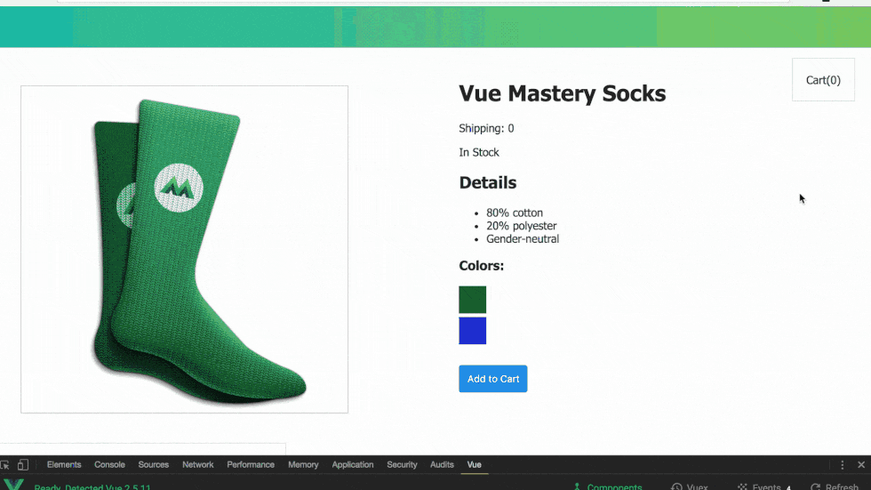

# Resources

## Getting Started

[Vue handbook](https://drive.google.com/file/d/1YHbzIlhTfU0SaWcX8LgpyG8nSnho75y-/view?usp=drivesdk)

## Documentation

1. [Vue Docs](https://vuejs.org/v2/guide/)
2. [Vue CLI](https://cli.vuejs.org/)
3. [Intro to Storefront](https://docs.vuestorefront.io/guide/)

### Resources

- [Style Guide](https://vuejs.org/v2/style-guide/)
- [Vue Cheat sheet](https://flaviocopes.com/vue-cheat-sheet/)
- [Awesome Vue](https://github.com/vuejs/awesome-vue)
- [Vue Component library](https://vuecidity.wemakesites.net/)

### Courses

- [Vue Crash Course](https://www.youtube.com/watch?v=Wy9q22isx3U) - Brad Traversy (ToDo app)
- - [ewd Notes](https://github.com/elementWebDev/vue_crash_todolist/blob/master/README.md)
- - [ToDo app](https://hopeful-meninsky-bf657b.netlify.com/#/) (ewd)
- [Vue Mastery](https://vuemastery.com) - ecommerce (example reactivity)
- - 
- [Vue JS 2 the Complete Guide](https://www.udemy.com/vuejs-2-the-complete-guide/) 

- - 